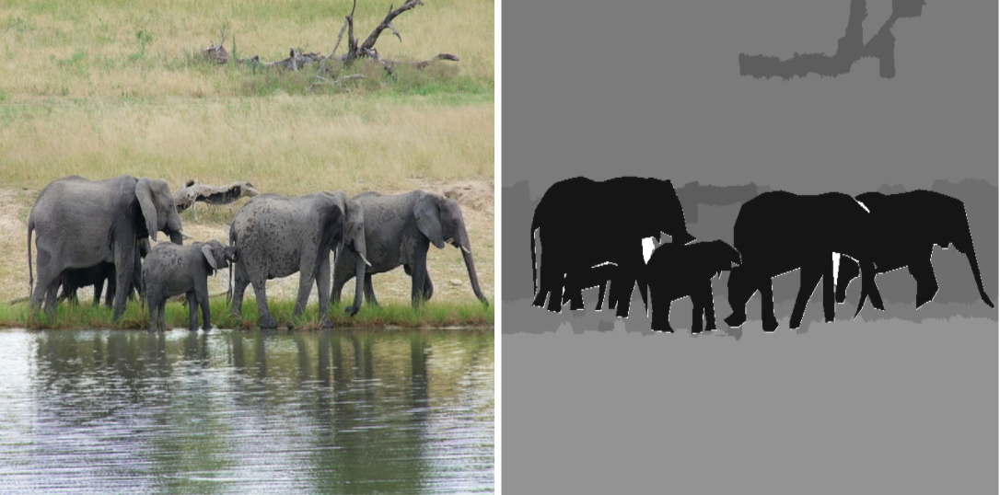
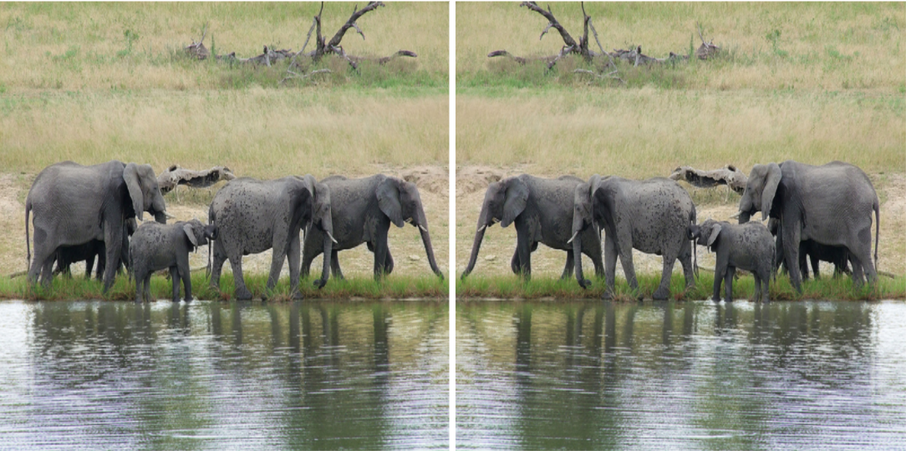

# Software Engineering Lab Assignment 3

## Python Datascience Assignment: Instance Segmentation and Detection

The details of each of the files/folders are as follows:

1. `main.py`: This is the main file which is to be called to execute the program. The main file calls the corresponding functions as needed while execution. The main file calls the appropriate function to prepare the dataset, then transform the images read, obtain the segmentation masks and bounding boxes of the objects present in the image by calling the segmentor model, and then plot the obtained images by calling the appropriate functions from the package described below.

2. `./my_package/model.py`: This file contains the instance segmentation model definition, a black-box model which takes an image (as numpy array) as input and provides the segmentation masks, bounding boxes as outputs and the corresponding class labels as for the input image.

&nbsp;

<b>Fig. 1</b>. Sample Output of the Segmentor. 

&nbsp;

3. `./my_package/data/dataset.py`: This file contains the class `Dataset` that reads the provided dataset from the annotation file and provides the numpy version of the images which are to be transformed and forwarded through the model. The annotation format is provided in `data/README.md`

4. `./my_package/data/transforms`: This folder contains 5 files. Each of these files is responsible for performing the corresponding transformation, as follows:

a) `crop.py`: This file takes an image (as numpy array) as input and crops it based on the provided arguments.

&nbsp;

<b>Fig. (a)</b>. Crop Operation. 

&nbsp;
	
b) `flip.py`: This file takes an image (as numpy array) as input and flips it based on the provided arguments.

&nbsp;

<b>Fig. (b)</b>. Flip Operation. 

&nbsp;
	
c) `rotate.py`: This file takes an image (as numpy array) as input and rotates it based on the provided arguments.

&nbsp;

<b>Fig. (c)</b>. Rotate Operation. 

&nbsp;

d) `rescale.py`: This file takes an image (as numpy array) as input and rescales it based on the provided arguments.

&nbsp;

<b>Fig. (d)</b>. Rescale Operation. 

&nbsp;

e) `blur.py`: This file takes an image (as numpy array) as input and applies a gaussian blur to it based on the provided arguments.

&nbsp;

<b>Fig. (e)</b>. Blur Operation. 

&nbsp;

5. `./my_package/analysis/visualize.py`: This file defines a function that draws the image with the predicted segmentation masks and the bounding boxes (with the corresponding labels) on the image and saves them in the specified output folder.

#### Note: This project uses PIL instead of OpenCV as OpenCV uses `BGR` format instead of `RGB`.

### Use case #1:
This software saves the predicted bounding boxes for all the images provided in the `data/imgs` folder, into `outputs` folder.

### Use case #2:
The following transforms of `img/6.jpg` are plotted using `subplots` in matplotlib and saved into the `outputs` folder:

1. Horizontally flipped original image along with the top-3 predicted segmentation masks and bounding boxes.

2. Blurred image (with some degree of blurring) along with the top-3 predicted segmentation masks and bounding boxes.

3. Twice Rescaled image (2X scaled) along with the top-3 predicted segmentation masks and bounding boxes.

4. Half Rescaled image (0.5X scaled) along with the top-3 predicted segmentation masks and bounding boxes.

5. 90 degree right rotated image along with the top-3 predicted segmentation masks and bounding boxes.

6. 45 degree left rotated image along with the top-3 predicted segmentation masks and bounding boxes.
